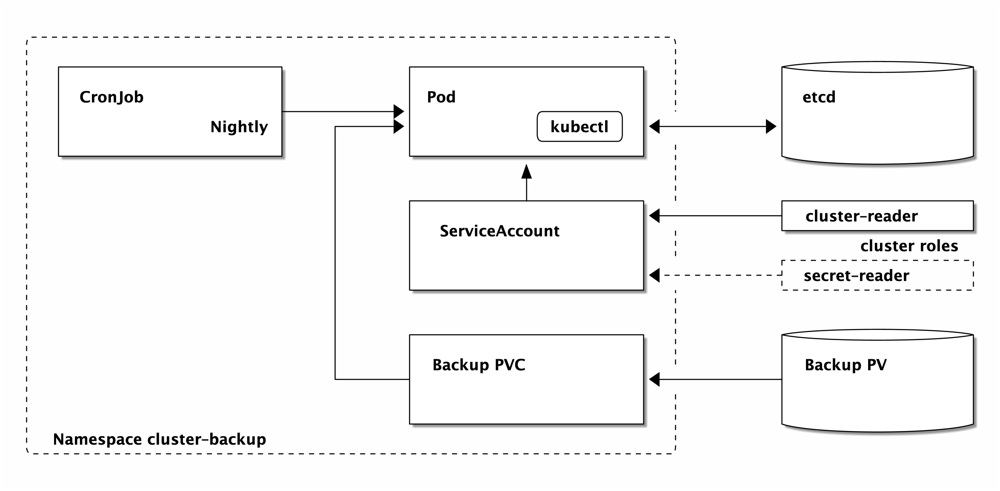
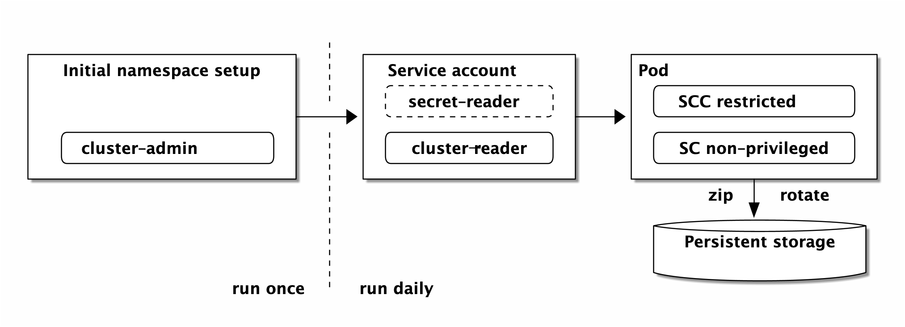

# Kubernetes namespace backup




This project sets up a CronJob running a basic namespace backup script `namespace_export.sh` (based on `project_export.sh` on [GitHub](https://raw.githubusercontent.com/gerald1248/k8s-ansible-contrib/refactor_export/reference-architecture/day2ops/scripts/project_export.sh).

Please note that no attempt is made to back up the contents of databases or mounted persistent volumes. This backup focuses on the API objects stored in `etcd`.

Admin access is required at the start (to create project and the `cluster-reader` and `secret-reader` ClusterRoleBindings for the service account), but from then on access is strictly controlled.

**NOTE** `secret-reader` is only needed if you intend to backup Secrets. To not backup Secrets, adjust `values.yaml` or pass `set backup-secrets=false` to `helm`.



## Environment variables

| Name                         | Default            | Description                                                                    |
| ---------------------------- | ------------------ | ------------------------------------------------------------------------------ |
| `BACKUP_SECRETS`             | `true`             | If Secrets should also be backed up.                                           |
| `K8S_BACKUP_NAME`      | `k8s-backup` | Name of each API object                                                        |
| `K8S_BACKUP_NAMESPACE` | `cluster-backup`   | The project that is created for the test runner                                |
| `K8S_BACKUP_CAPACITY`  | `2Gi`              | Create a PersistentVolumeClaim with this size and use it to store the backups. |
| `K8S_BACKUP_SCHEDULE`  | `15 0 * * *`       | The schedule at which the backup CronJob will be run.                          |

## Set the timer
```
$ make
```

## Build your own Docker image
You can skip this step if you're happy to use the Docker Hub image that accompanies this repo (`gerald1248/k8s-backup`).

```
$ make build
```

The current version is built from this repo.

## Cleanup
Call `make delete` to remove the objects installed.

## Run the tests
```
$ make test
```
This will build the image and check the installed tools are present.
